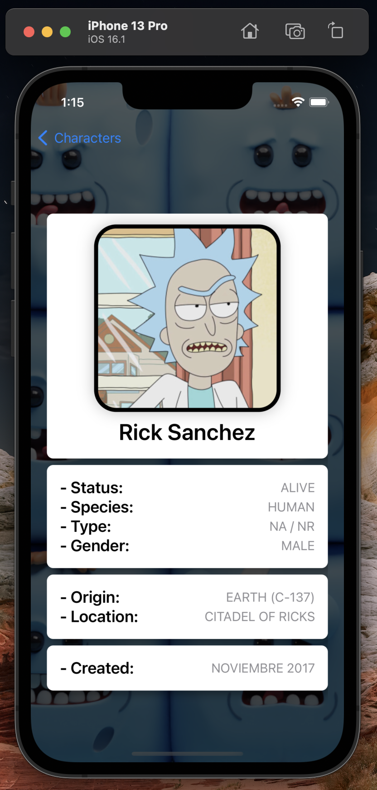
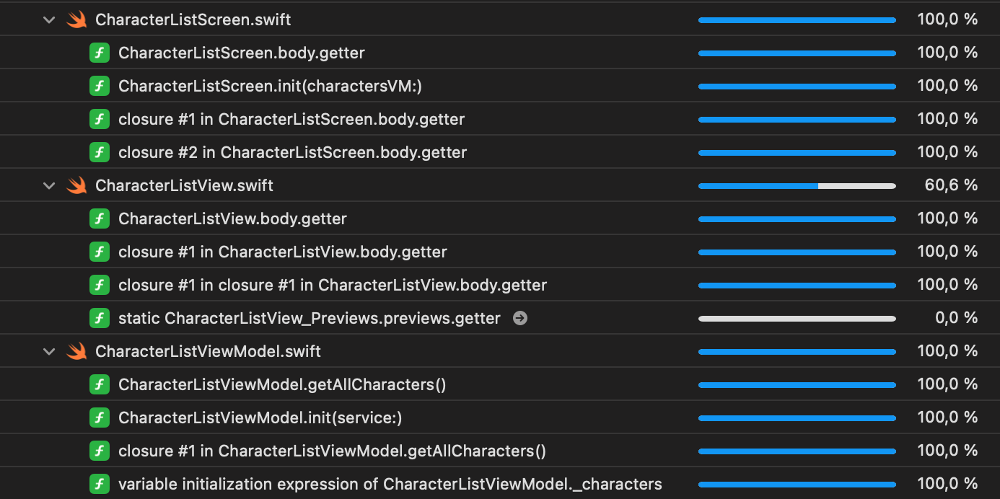

# EvilMorty 
  
## Evidencia  

**iPhone Detail**

**iPhone List**

**iPad Detail**

**iPad List**

## Parte Tecnica

**Herramientas:** Xcode 14.1, Swift, SwiftUI

**Dispositivos** iPhone, iPad

**API:** [The Rick and Morty API](https://rickandmortyapi.com)

**Framework** [SnapshotTesting](https://github.com/pointfreeco/swift-snapshot-testing)

## Caracteristicas  

- Dark mode
- Fullscreen mode  
- Cross platform
- iPhone Portrait
- iPad Landscape

## Arquitectura

Se manejo MVVM para el desarrollo de la prueba integrando DI en los componentes ViewModel, 
para realizar los UT en los componentes Screen se implemento el Framework SnapshotTesting.

## Run Locally  

Clone the project  

~~~bash  
  git clone https://github.com/pdramoss/EvilMorty.git
~~~

## Coverage

**Full Coverage**

**Character Detail Coverage**

**Character List Coverage**

**Character Networking Coverage**

